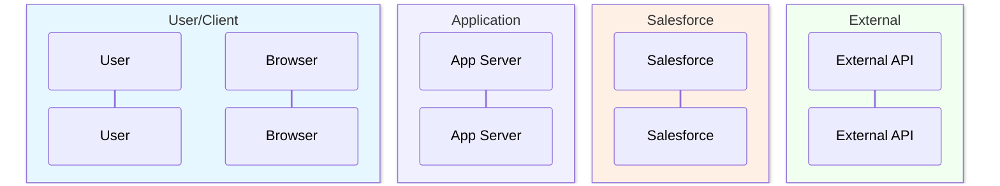
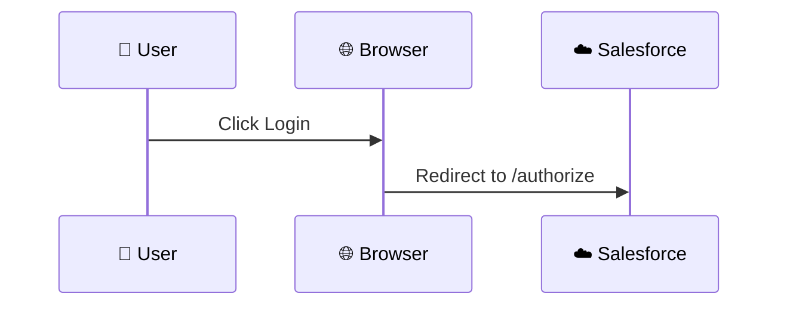
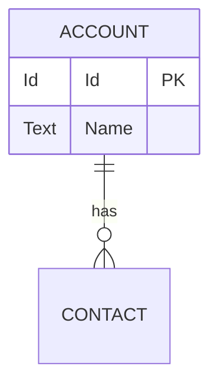
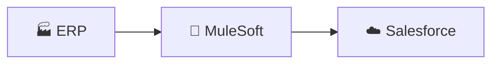

# sf-diagram Color Palette

Accessibility-focused color palette inspired by CloudSundial and Jon Jordan's color-blind friendly design principles.

## Primary Palette

```
┌─────────────────────────────────────────────────────────────────────────┐
│  COMPONENT                │  COLOR NAME    │  HEX       │  RGB          │
├───────────────────────────┼────────────────┼────────────┼───────────────┤
│  User/Browser             │  Salesforce    │  #00A1E0   │  0, 161, 224  │
│  Client Application       │  Navy Blue     │  #032D60   │  3, 45, 96    │
│  Salesforce (Auth Server) │  Orange        │  #FF6D00   │  255, 109, 0  │
│  Resource Server/API      │  Green         │  #04844B   │  4, 132, 75   │
│  External IdP             │  Purple        │  #9050E9   │  144, 80, 233 │
│  Middleware/Integration   │  Teal          │  #06A59A   │  6, 165, 154  │
│  Database/Storage         │  Indigo        │  #5867E8   │  88, 103, 232 │
└───────────────────────────┴────────────────┴────────────┴───────────────┘
```

## Status Colors

```
┌─────────────────────────────────────────────────────────────────────────┐
│  STATUS                   │  COLOR NAME    │  HEX       │  USAGE        │
├───────────────────────────┼────────────────┼────────────┼───────────────┤
│  Success                  │  Green         │  #2E844A   │  ✅ Completed │
│  Error/Failure            │  Red           │  #EA001E   │  ❌ Failed    │
│  Warning                  │  Yellow        │  #FE9339   │  ⚠️ Warning   │
│  Info/Neutral             │  Gray          │  #706E6B   │  ℹ️ Info      │
│  Pending/Processing       │  Blue          │  #0176D3   │  ⏳ In Progress│
└───────────────────────────┴────────────────┴────────────┴───────────────┘
```

## Mermaid Theme Configuration

### Sequence Diagrams
```javascript
%%{init: {'theme': 'base', 'themeVariables': {
  'actorBkg': '#00A1E0',
  'actorTextColor': '#ffffff',
  'actorBorder': '#032D60',
  'signalColor': '#032D60',
  'signalTextColor': '#032D60',
  'labelBoxBkgColor': '#FF6D00',
  'labelBoxBorderColor': '#032D60',
  'labelTextColor': '#ffffff',
  'loopTextColor': '#032D60',
  'noteBkgColor': '#f0f0f0',
  'noteBorderColor': '#706E6B',
  'noteTextColor': '#032D60',
  'activationBkgColor': '#E1F5FE',
  'activationBorderColor': '#00A1E0',
  'sequenceNumberColor': '#ffffff'
}}}%%
```

### ER Diagrams
```javascript
%%{init: {'theme': 'base', 'themeVariables': {
  'primaryColor': '#00A1E0',
  'primaryTextColor': '#032D60',
  'primaryBorderColor': '#032D60',
  'lineColor': '#706E6B',
  'secondaryColor': '#f0f0f0',
  'tertiaryColor': '#E1F5FE'
}}}%%
```

### Flowcharts
```javascript
%%{init: {'theme': 'base', 'themeVariables': {
  'primaryColor': '#00A1E0',
  'primaryTextColor': '#ffffff',
  'primaryBorderColor': '#032D60',
  'lineColor': '#706E6B',
  'secondaryColor': '#FF6D00',
  'tertiaryColor': '#04844B',
  'background': '#ffffff',
  'mainBkg': '#00A1E0',
  'nodeBorder': '#032D60'
}}}%%
```

## Actor Box Colors (Sequence Diagrams)

Use `box rgb(R,G,B)` to group related actors:



### Box Color Reference

| Category | RGB | Hex | Description |
|----------|-----|-----|-------------|
| User/Client | `rgb(230,247,255)` | `#E6F7FF` | Light blue tint |
| Application | `rgb(240,240,255)` | `#F0F0FF` | Light lavender |
| Salesforce | `rgb(255,240,230)` | `#FFF0E6` | Light orange tint |
| External | `rgb(240,255,240)` | `#F0FFF0` | Light green tint |
| Middleware | `rgb(240,255,255)` | `#F0FFFF` | Light cyan |
| Database | `rgb(245,240,255)` | `#F5F0FF` | Light purple |

## Color Blind Accessibility

This palette is designed to be distinguishable for common forms of color blindness:

| Condition | Affected Colors | Our Approach |
|-----------|-----------------|--------------|
| Protanopia (red-blind) | Red/Green confusion | Use blue/orange as primary contrast |
| Deuteranopia (green-blind) | Red/Green confusion | Orange (#FF6D00) vs Blue (#00A1E0) |
| Tritanopia (blue-blind) | Blue/Yellow confusion | Use shape + color combinations |

### Key Principles

1. **High Contrast** - Text on colored backgrounds has minimum 4.5:1 contrast ratio
2. **Shape + Color** - Icons/emojis supplement color coding (👤 🌐 🖥️ ☁️)
3. **Distinct Hues** - Primary colors are well separated on the color wheel
4. **Pattern Fallback** - ASCII diagrams don't rely on color at all

## Icon Usage

Supplement colors with icons for clarity:

| Actor Type | Icon | Unicode |
|------------|------|---------|
| User | 👤 | U+1F464 |
| Browser | 🌐 | U+1F310 |
| Mobile App | 📱 | U+1F4F1 |
| Server | 🖥️ | U+1F5A5 |
| Cloud/Salesforce | ☁️ | U+2601 |
| Database | 💾 | U+1F4BE |
| API/Service | ⚙️ | U+2699 |
| Security/Auth | 🔐 | U+1F510 |
| External System | 🏭 | U+1F3ED |
| Middleware | 🔄 | U+1F504 |
| Event/Message | 📢 | U+1F4E2 |
| Success | ✅ | U+2705 |
| Error | ❌ | U+274C |
| Warning | ⚠️ | U+26A0 |

## Usage Examples

### OAuth Flow (Sequence)


### Data Model (ERD)


### Integration (Flowchart)


## Dark Mode Considerations

For dark backgrounds, invert the palette:

| Light Mode | Dark Mode |
|------------|-----------|
| `#032D60` (text) | `#E1F5FE` (text) |
| `#ffffff` (bg) | `#1a1a2e` (bg) |
| `#f0f0f0` (note bg) | `#2a2a3e` (note bg) |

## References

- [Salesforce Lightning Design System - Color](https://www.lightningdesignsystem.com/design-tokens/#category-color)
- [CloudSundial Accessibility Approach](https://cloudsundial.com/diagrams-of-identity-flows-in-context)
- [Jon Jordan's Color-Blind Friendly Design](https://www.salesforce.com/blog/how-salesforce-maps-color-blind-friendly/)
