# Mermaid Quick Reference

Quick reference guide for Mermaid diagram syntax used in sf-diagram.

## Sequence Diagrams

### Basic Syntax

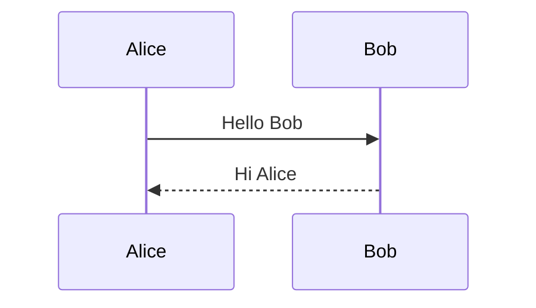

### Arrow Types

| Arrow | Meaning | Usage |
|-------|---------|-------|
| `->` | Solid line, no head | Internal processing |
| `-->` | Dotted line, no head | Optional/weak connection |
| `->>` | Solid line, arrowhead | Request/Call |
| `-->>` | Dotted line, arrowhead | Response/Return |
| `-x` | Solid line, X end | Failed/Cancelled |
| `--x` | Dotted line, X end | Failed response |
| `-)` | Solid, open arrow | Async (fire-and-forget) |
| `--)` | Dotted, open arrow | Async response |

### Participants and Actors

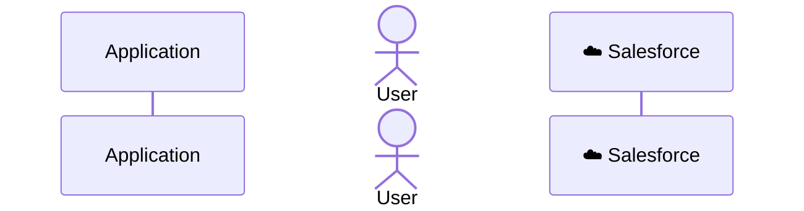

### Grouping with Boxes

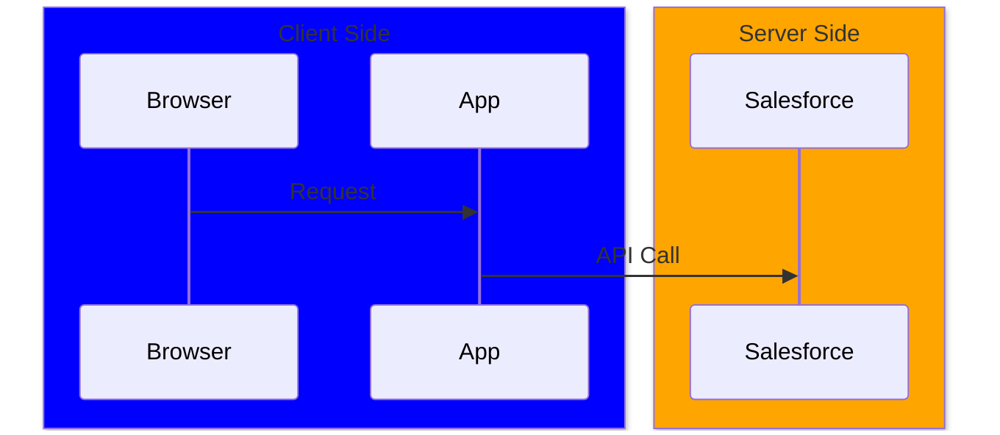

### Activation (Lifelines)

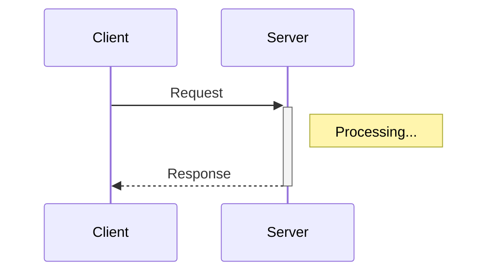

Shorthand: `+` activates, `-` deactivates

### Loops and Conditionals

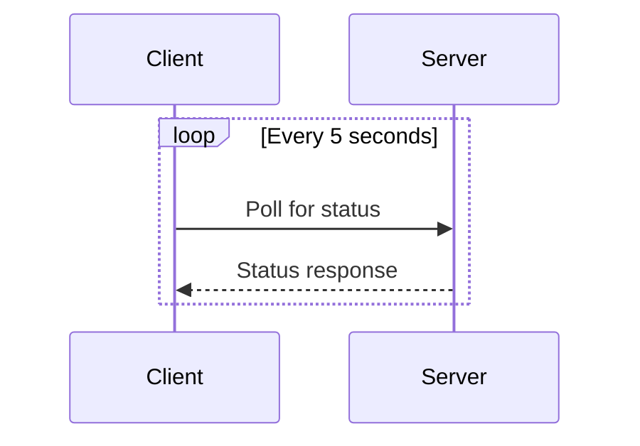

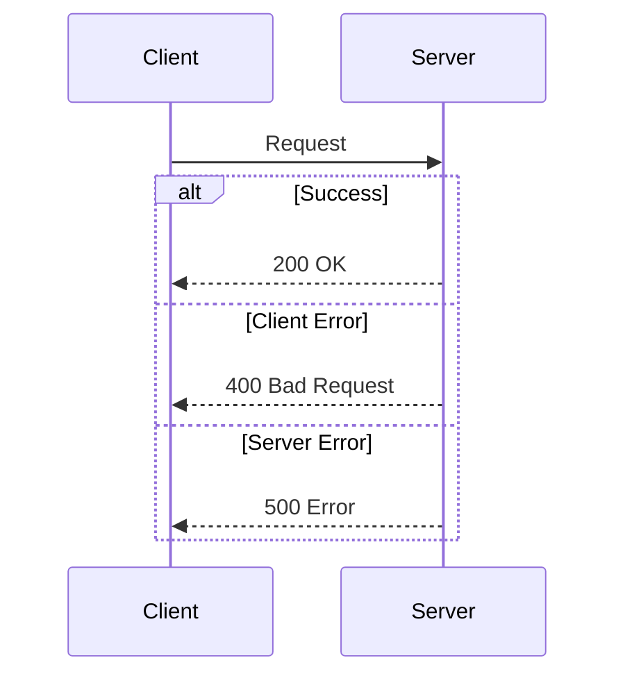

### Notes

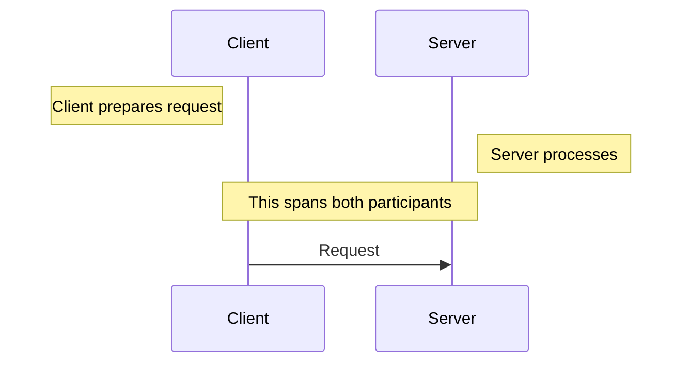

### Autonumber

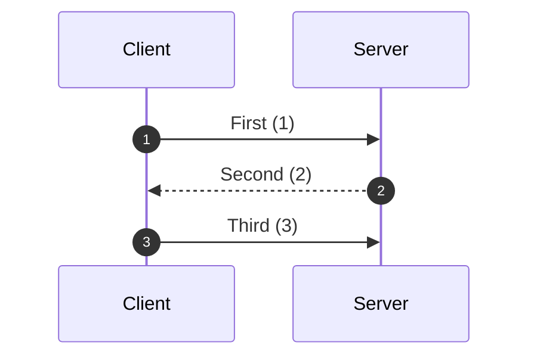

### Breaks and Critical Sections

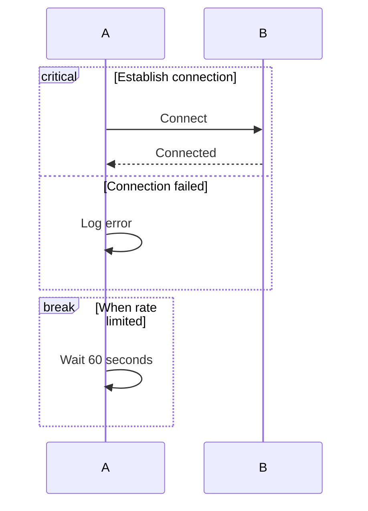

---

## Entity Relationship Diagrams

### Basic Syntax

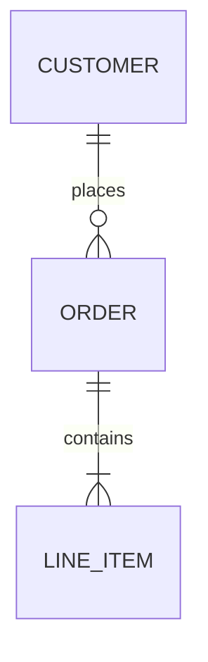

### Cardinality Notation

| Symbol | Meaning |
|--------|---------|
| `\|o` | Zero or one |
| `\|\|` | Exactly one |
| `}o` | Zero or many |
| `}\|` | One or many |

### Full Cardinality Examples

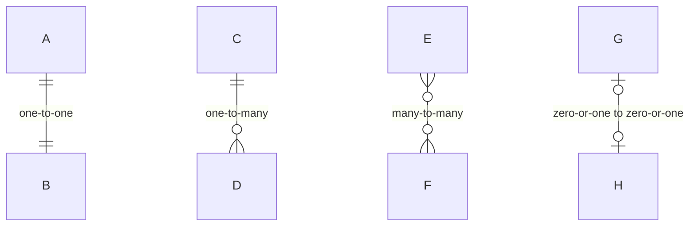

### Entity Attributes

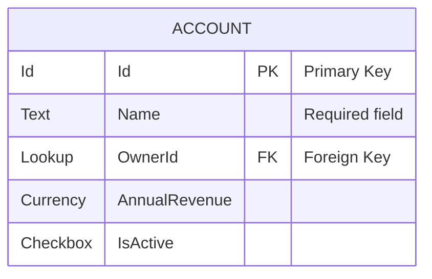

### Attribute Keys

| Key | Meaning |
|-----|---------|
| PK | Primary Key |
| FK | Foreign Key |
| UK | Unique Key |

---

## Flowcharts

### Basic Syntax

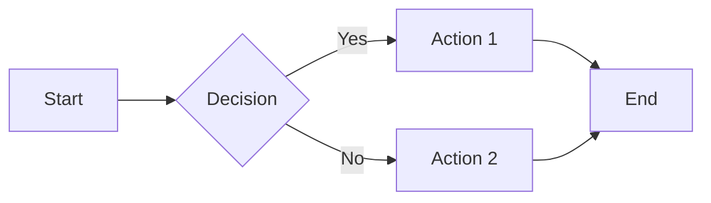

### Direction

| Code | Direction |
|------|-----------|
| `TB` / `TD` | Top to Bottom |
| `BT` | Bottom to Top |
| `LR` | Left to Right |
| `RL` | Right to Left |

### Node Shapes

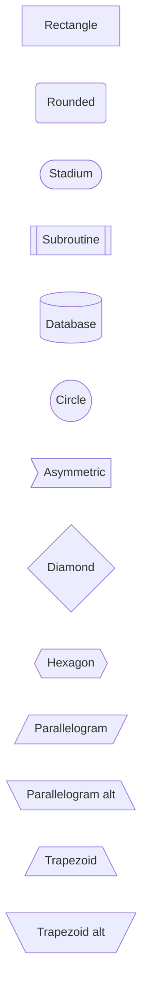

### Link Types

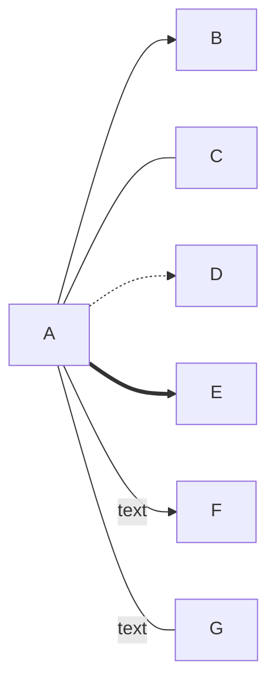

| Link | Description |
|------|-------------|
| `-->` | Arrow |
| `---` | Line (no arrow) |
| `-.->` | Dotted arrow |
| `==>` | Thick arrow |
| `--text-->` | Arrow with text |

### Subgraphs

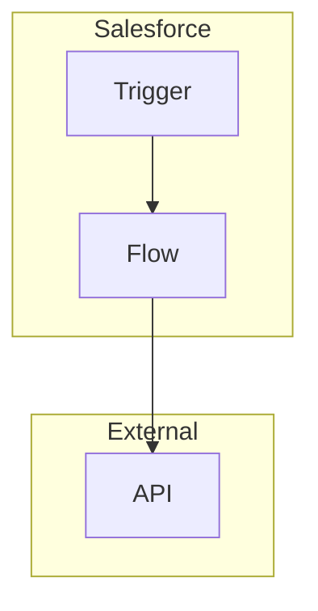

---

## Theming

### Init Directive

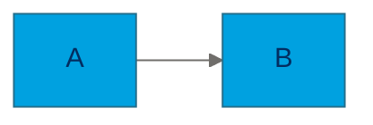

### Available Themes

| Theme | Description |
|-------|-------------|
| `default` | Standard theme |
| `base` | Base for customization |
| `dark` | Dark mode |
| `forest` | Green tones |
| `neutral` | Grayscale |

### Common Theme Variables

**Sequence Diagrams:**
- `actorBkg`, `actorTextColor`, `actorBorder`
- `signalColor`, `signalTextColor`
- `labelBoxBkgColor`, `labelTextColor`
- `noteBkgColor`, `noteTextColor`

**ER Diagrams:**
- `primaryColor`, `primaryTextColor`
- `lineColor`
- `attributeBackgroundColorOdd/Even`

**Flowcharts:**
- `primaryColor`, `primaryTextColor`
- `lineColor`, `nodeBorder`
- `mainBkg`, `clusterBkg`

---

## Special Characters

### Escaping

Use `#` codes for special characters:

| Code | Character |
|------|-----------|
| `#quot;` | " |
| `#amp;` | & |
| `#lt;` | < |
| `#gt;` | > |
| `#59;` | ; |

### Line Breaks in Text

Use `<br/>` for line breaks:

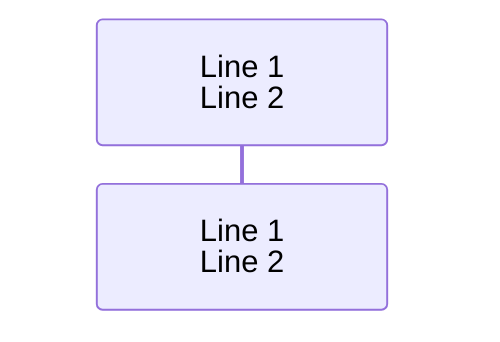

---

## Tips and Tricks

### 1. Comments

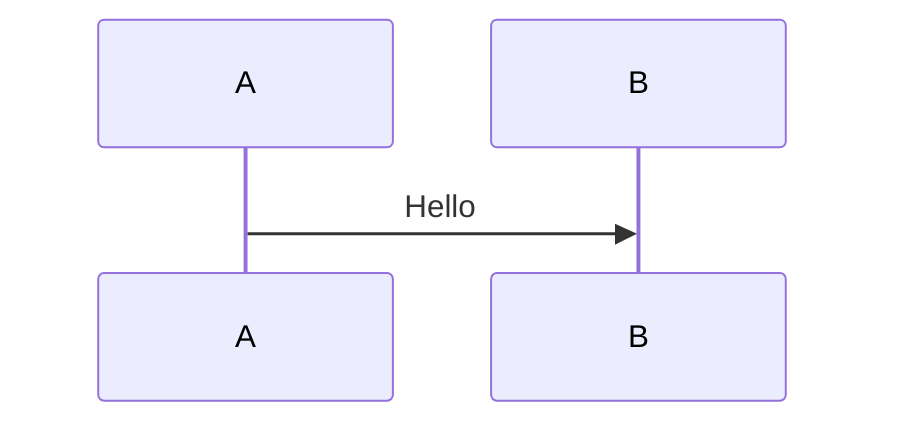

### 2. Multiline Notes

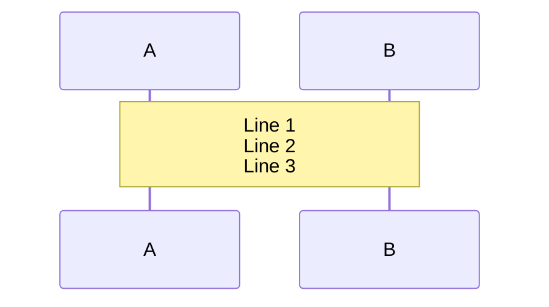

### 3. Styling Individual Nodes

```mermaid
flowchart LR
    A:::success --> B:::error

    classDef success fill:#2E844A,color:#fff
    classDef error fill:#EA001E,color:#fff
```

### 4. Click Events (Interactive)

```mermaid
flowchart LR
    A[Salesforce Docs]
    click A "https://developer.salesforce.com" "Open Docs"
```

---

## Resources

- [Mermaid Official Docs](https://mermaid.js.org/intro/)
- [Mermaid Live Editor](https://mermaid.live/)
- [Sequence Diagram Syntax](https://mermaid.js.org/syntax/sequenceDiagram.html)
- [ER Diagram Syntax](https://mermaid.js.org/syntax/entityRelationshipDiagram.html)
- [Flowchart Syntax](https://mermaid.js.org/syntax/flowchart.html)
