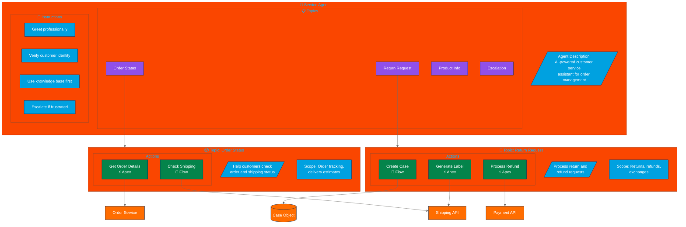
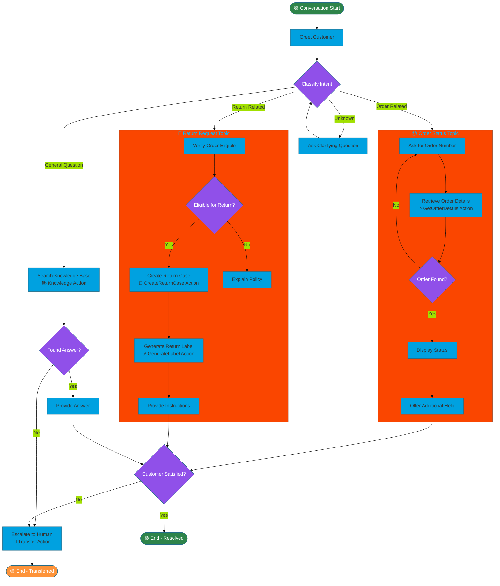

# Agentforce Flow Diagram Template

Flowchart template for visualizing Agentforce agent architecture and conversation flows.

## When to Use
- Documenting Agentforce agent structure
- Planning agent topics and actions
- Visualizing conversation flows
- Architecture reviews

## Mermaid Template - Agent Structure



## Mermaid Template - Conversation Flow



## ASCII Fallback Template

```
┌─────────────────────────────────────────────────────────────────────────────┐
│                        🤖 SERVICE AGENT STRUCTURE                           │
└─────────────────────────────────────────────────────────────────────────────┘

┌─────────────────────────────────────────────────────────────────────────────┐
│  AGENT: Customer Service Bot                                                │
│  ─────────────────────────────                                              │
│  Description: AI-powered assistant for order and return inquiries           │
│                                                                             │
│  Instructions:                                                              │
│  • Greet customers professionally                                           │
│  • Verify identity before sharing order details                             │
│  • Search knowledge base before escalating                                  │
│  • Escalate if customer expresses frustration                               │
└─────────────────────────────────────────────────────────────────────────────┘
          │
          │
          ▼
┌─────────────────────────────────────────────────────────────────────────────┐
│  📋 TOPICS                                                                  │
│  ┌───────────────────┐  ┌───────────────────┐  ┌───────────────────┐       │
│  │  📦 Order Status  │  │ 🔄 Return Request │  │  ❓ General Help  │       │
│  │                   │  │                   │  │                   │       │
│  │  Scope:           │  │  Scope:           │  │  Scope:           │       │
│  │  - Track orders   │  │  - Process return │  │  - FAQ answers    │       │
│  │  - Delivery ETA   │  │  - Generate label │  │  - Knowledge base │       │
│  │  - Order history  │  │  - Refund status  │  │  - Escalation     │       │
│  └─────────┬─────────┘  └─────────┬─────────┘  └─────────┬─────────┘       │
└────────────│──────────────────────│──────────────────────│──────────────────┘
             │                      │                      │
             ▼                      ▼                      ▼
┌─────────────────────────────────────────────────────────────────────────────┐
│  ⚡ ACTIONS                                                                 │
│  ┌───────────────────┐  ┌───────────────────┐  ┌───────────────────┐       │
│  │ GetOrderDetails   │  │ CreateReturnCase  │  │ SearchKnowledge   │       │
│  │ [Apex Invocable]  │  │ [Flow]            │  │ [Standard Action] │       │
│  ├───────────────────┤  ├───────────────────┤  ├───────────────────┤       │
│  │ Input:            │  │ Input:            │  │ Input:            │       │
│  │ - orderNumber     │  │ - orderId         │  │ - query           │       │
│  │ - customerId      │  │ - reason          │  │ - language        │       │
│  │                   │  │ - quantity        │  │                   │       │
│  │ Output:           │  │ Output:           │  │ Output:           │       │
│  │ - status          │  │ - caseId          │  │ - articles[]      │       │
│  │ - items[]         │  │ - returnLabel     │  │ - confidence      │       │
│  │ - trackingUrl     │  │ - instructions    │  │                   │       │
│  └───────────────────┘  └───────────────────┘  └───────────────────┘       │
└─────────────────────────────────────────────────────────────────────────────┘
             │                      │                      │
             ▼                      ▼                      ▼
┌─────────────────────────────────────────────────────────────────────────────┐
│  🔗 INTEGRATIONS                                                            │
│  ┌───────────────────┐  ┌───────────────────┐  ┌───────────────────┐       │
│  │   Order Service   │  │   Shipping API    │  │  Knowledge Base   │       │
│  │   (Salesforce)    │  │   (FedEx/UPS)     │  │   (Salesforce)    │       │
│  └───────────────────┘  └───────────────────┘  └───────────────────┘       │
└─────────────────────────────────────────────────────────────────────────────┘
```

## Agent Components

| Component | Description | Example |
|-----------|-------------|---------|
| Agent | The AI assistant container | Service Agent, SDR Agent |
| Topic | Conversation category | Order Status, Returns |
| Action | Executable capability | Apex method, Flow |
| Instruction | Behavioral guideline | "Always verify identity" |
| Scope | Topic boundaries | What's in/out of scope |

## Action Types

| Type | Icon | Use Case |
|------|------|----------|
| Apex Invocable | ⚡ | Complex logic, callouts |
| Flow | 🔄 | Record creation, updates |
| Standard | 📚 | Knowledge search, case creation |
| Prompt Template | 💬 | Dynamic response generation |

## Conversation Flow Patterns

### 1. Linear Flow
```
Start → Topic → Action → Response → End
```

### 2. Branching Flow
```
Start → Classify → [Topic A | Topic B | Escalate]
```

### 3. Loop Back
```
Start → Topic → Action → Validate → [Success | Retry]
```

## Best Practices

1. **Clear topic boundaries** - Don't overlap scope
2. **Minimal actions per topic** - 3-5 max
3. **Always have escalation path** - Human handoff
4. **Use knowledge base first** - Before custom actions
5. **Verify before acting** - Confirm understanding

## Customization Points

- Replace example topics with actual use cases
- Add specific action inputs/outputs
- Include actual integration endpoints
- Show conversation sample flows
