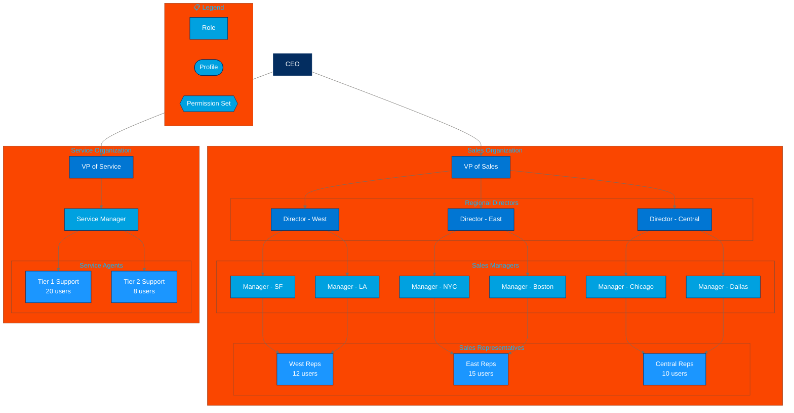
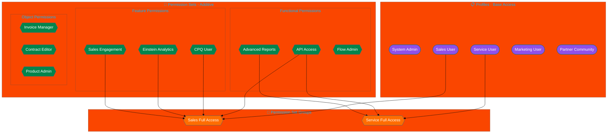
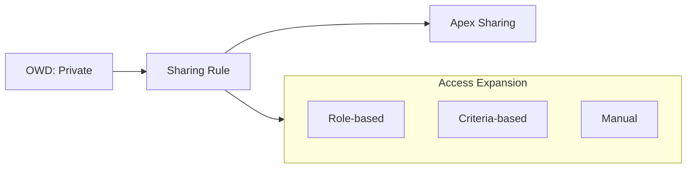

# Role Hierarchy Diagram Template

Flowchart template for visualizing Salesforce role hierarchies and permission structures.

## When to Use
- Documenting org security model
- Planning role hierarchy changes
- Explaining data access patterns
- Security review presentations

## Mermaid Template - Sales Role Hierarchy



## Mermaid Template - Profile & Permission Set Structure



## ASCII Fallback Template

```
┌─────────────────────────────────────────────────────────────────────────────┐
│                           ROLE HIERARCHY                                    │
└─────────────────────────────────────────────────────────────────────────────┘

                                   ┌─────────┐
                                   │   CEO   │
                                   └────┬────┘
                                        │
                    ┌───────────────────┴───────────────────┐
                    │                                       │
             ┌──────▼──────┐                        ┌──────▼──────┐
             │ VP of Sales │                        │ VP of Svc   │
             └──────┬──────┘                        └──────┬──────┘
                    │                                      │
     ┌──────────────┼──────────────┐              ┌────────▼────────┐
     │              │              │              │ Service Manager │
     ▼              ▼              ▼              └────────┬────────┘
┌─────────┐  ┌─────────┐  ┌─────────┐                     │
│Director │  │Director │  │Director │          ┌──────────┼──────────┐
│  West   │  │  East   │  │ Central │          ▼          ▼          │
└────┬────┘  └────┬────┘  └────┬────┘    ┌─────────┐ ┌─────────┐    │
     │            │            │         │ Tier 1  │ │ Tier 2  │    │
     ▼            ▼            ▼         │ Support │ │ Support │    │
┌─────────┐ ┌─────────┐ ┌─────────┐      │ (20)    │ │  (8)    │    │
│Manager  │ │Manager  │ │Manager  │      └─────────┘ └─────────┘    │
│SF | LA  │ │NYC|BOS  │ │CHI|DAL  │                                 │
└────┬────┘ └────┬────┘ └────┬────┘                                 │
     │           │           │                                       │
     ▼           ▼           ▼                                       │
┌─────────┐ ┌─────────┐ ┌─────────┐                                 │
│ West    │ │ East    │ │ Central │                                 │
│ Reps    │ │ Reps    │ │ Reps    │                                 │
│  (12)   │ │  (15)   │ │  (10)   │                                 │
└─────────┘ └─────────┘ └─────────┘                                 │

┌─────────────────────────────────────────────────────────────────────────────┐
│  DATA ACCESS FLOW                                                           │
│  ─────────────────                                                          │
│  • Roles ABOVE can see records owned by roles BELOW                         │
│  • CEO sees ALL sales and service data                                      │
│  • VP Sales sees all sales data, NOT service data                           │
│  • Managers see only their team's records                                   │
│  • Reps see only their own records                                          │
└─────────────────────────────────────────────────────────────────────────────┘
```

## Security Components

| Component | Purpose | Shape |
|-----------|---------|-------|
| Role | Data visibility hierarchy | Rectangle |
| Profile | Base object/field access | Rounded |
| Permission Set | Additive permissions | Hexagon |
| Permission Set Group | Bundle of perm sets | Hexagon (orange) |

## Data Access Patterns

### OWD (Organization-Wide Defaults)

| Setting | Meaning |
|---------|---------|
| Private | Owner + hierarchy above |
| Public Read Only | All can view |
| Public Read/Write | All can edit |
| Controlled by Parent | Inherits from master |

### Sharing Rules



## Best Practices

1. **Minimize role levels** - 3-5 levels max
2. **Use Permission Set Groups** - Easier to manage
3. **Document exceptions** - Note any sharing rules
4. **Show user counts** - Understand scale
5. **Include profiles** - Show base access

## Customization Points

- Replace example roles with actual org structure
- Add specific user counts
- Include custom permission sets
- Show sharing rule exceptions
