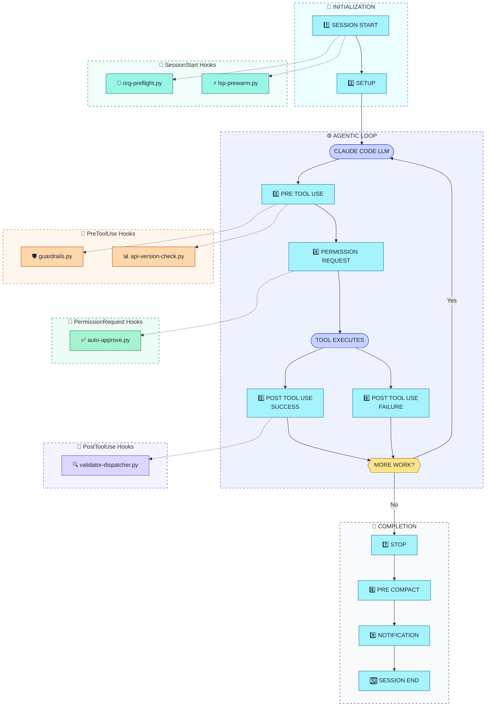

# SF-Skills Hook Architecture Diagram

> Visual representation of how SF-Skills hooks integrate with Claude Code's lifecycle events

---

## Claude Code Hook Lifecycle with SF-Skills Hooks



---

## ASCII Fallback

For terminals and viewers that don't render Mermaid:

```
┌─────────────────────────────────────────────────────────────────────────────────┐
│                     CLAUDE CODE HOOK LIFECYCLE (SF-SKILLS)                      │
└─────────────────────────────────────────────────────────────────────────────────┘

┌─────────────────────────────────────────────────────────────────────────────────┐
│  🚀 INITIALIZATION                                                              │
│  ┌─────────────────┐    ┌─────────────────┐                                    │
│  │ 1. SESSION START│───▶│    2. SETUP     │                                    │
│  └────────┬────────┘    └────────┬────────┘                                    │
│           │                      │                                              │
│           ▼                      │                                              │
│  ┌─────────────────────────┐     │                                              │
│  │ 🔌 org-preflight.py     │     │                                              │
│  │ ⚡ lsp-prewarm.py       │     │                                              │
│  └─────────────────────────┘     │                                              │
└──────────────────────────────────│──────────────────────────────────────────────┘
                                   │
                                   ▼
┌─────────────────────────────────────────────────────────────────────────────────┐
│  ⚙️ AGENTIC LOOP                              ┌───────────────────────────────┐ │
│  ┌─────────────────────────────┐              │ 🛡️ guardrails.py             │ │
│  │   CLAUDE CODE / LLM        │◀─────┐       │ 📊 api-version-check.py      │ │
│  └──────────────┬──────────────┘      │       └───────────────────────────────┘ │
│                 │                     │                      ▲                  │
│                 ▼                     │       ┌──────────────┘                  │
│  ┌─────────────────────────────┐      │       │                                 │
│  │     3. PRE TOOL USE         │──────┼───────┘                                 │
│  └──────────────┬──────────────┘      │       ┌───────────────────────────────┐ │
│                 │                     │       │ ✅ auto-approve.py            │ │
│                 ▼                     │       └───────────────────────────────┘ │
│  ┌─────────────────────────────┐      │                      ▲                  │
│  │   4. PERMISSION REQUEST     │──────┼──────────────────────┘                  │
│  └──────────────┬──────────────┘      │                                         │
│                 │                     │                                         │
│                 ▼                     │                                         │
│  ┌─────────────────────────────┐      │                                         │
│  │      TOOL EXECUTES          │      │                                         │
│  └──────────────┬──────────────┘      │                                         │
│                 │                     │       ┌───────────────────────────────┐ │
│        ┌───────┴───────┐              │       │ 🔍 validator-dispatcher.py   │ │
│        ▼               ▼              │       └───────────────────────────────┘ │
│  ┌───────────┐   ┌───────────┐        │                      ▲                  │
│  │ 5. POST   │   │ 6. POST   │        │                      │                  │
│  │ SUCCESS   │───│ FAILURE   │────────┼──────────────────────┘                  │
│  └─────┬─────┘   └─────┬─────┘        │                                         │
│        │               │              │                                         │
│        └───────┬───────┘              │                                         │
│                ▼                      │                                         │
│       ┌─────────────────┐             │                                         │
│       │   MORE WORK?    │             │                                         │
│       └───┬─────────┬───┘             │                                         │
│      Yes  │         │ No              │                                         │
│           │         │                 │                                         │
│           └─────────┼─────────────────┘                                         │
│                     │                                                           │
└─────────────────────│───────────────────────────────────────────────────────────┘
                      │
                      ▼
┌─────────────────────────────────────────────────────────────────────────────────┐
│  🏁 COMPLETION                                                                  │
│  ┌─────────────────┐    ┌─────────────────┐    ┌─────────────────┐             │
│  │    7. STOP      │───▶│ 8. PRE COMPACT  │───▶│ 9. NOTIFICATION │             │
│  └─────────────────┘    └─────────────────┘    └────────┬────────┘             │
│                                                         │                       │
│                                                         ▼                       │
│                                                ┌─────────────────┐              │
│                                                │ 10. SESSION END │              │
│                                                └─────────────────┘              │
└─────────────────────────────────────────────────────────────────────────────────┘
```

---

## Hook Summary Table

| Event | Hook Script | Purpose | Action Type |
|-------|-------------|---------|-------------|
| **SessionStart** | `org-preflight.py` | Validate SF org connectivity | State file |
| **SessionStart** | `lsp-prewarm.py` | Spawn LSP servers in background | Background |
| **PreToolUse** | `guardrails.py` | Block dangerous operations | BLOCK/MODIFY |
| **PreToolUse** | `api-version-check.py` | Check API version compatibility | WARN |
| **PermissionRequest** | `auto-approve.py` | Smart auto-approval for safe ops | APPROVE/DENY |
| **PostToolUse** | `validator-dispatcher.py` | Route to skill-specific validators | Feedback |

---

## Hook Event Reference

### Lifecycle Events (10 total)

| # | Event | When | Hook Output |
|---|-------|------|-------------|
| 1 | **SessionStart** | Claude Code session begins | State files, background tasks |
| 2 | **Setup** | Configuration loaded | (no hooks) |
| 3 | **PreToolUse** | Before tool executes | ALLOW, BLOCK, MODIFY |
| 4 | **PermissionRequest** | Tool needs approval | APPROVE, DENY, defer to user |
| 5 | **PostToolUse (success)** | Tool completed successfully | Feedback |
| 6 | **PostToolUse (failure)** | Tool failed | Error analysis |
| 7 | **Stop** | LLM turn complete | (no hooks) |
| 8 | **PreCompact** | Before context compaction | (no hooks) |
| 9 | **Notification** | User notification sent | (no hooks) |
| 10 | **SessionEnd** | Session terminates | Cleanup |

---

## Color Legend

| Color | Hex | Meaning | Nodes |
|-------|-----|---------|-------|
| 🟦 Cyan-200 | `#a5f3fc` | Lifecycle event nodes | S1-S10 |
| 🟩 Teal-200 | `#99f6e4` | SessionStart hooks | org-preflight, lsp-prewarm |
| 🟧 Orange-200 | `#fed7aa` | Guards/Pre-checks | guardrails, api-version-check |
| 🟢 Green-200 | `#a7f3d0` | Approval hooks | auto-approve |
| 🟣 Violet-200 | `#ddd6fe` | Validation | validator-dispatcher |
| 🔵 Indigo-200 | `#c7d2fe` | Execution | LLM, EXEC |
| 🟡 Amber-200 | `#fde68a` | Decision points | MORE WORK? |

---

## Hook Interaction Patterns

### Pattern 1: Blocking Flow

```
PreToolUse → guardrails.py
         ├─ Allow: Continue to Permission Request
         └─ Block: Return error message to LLM
                   (tool never executes)
```

### Pattern 2: Auto-Approval

```
PermissionRequest → auto-approve.py
         ├─ Approve: Tool executes without user prompt
         ├─ Deny: Block with reason
         └─ No output: Defer to user (shows permission dialog)
```

### Pattern 3: Feedback Loop

```
PostToolUse → validator-dispatcher.py → Validates file
                                      → Sends feedback to LLM
```

### Pattern 4: Workflow Tracking

```
SessionStart → org-preflight.py → Writes ~/.claude/.sf-org-state.json
           → lsp-prewarm.py → Writes ~/.claude/.lsp-prewarm-state.json
                            → Status line reads these files
```

---

## Related Documentation

- [Hooks Frontmatter Schema](./hooks-frontmatter-schema.md) - Hook configuration format
- [install.py](../../../tools/install.py) - Unified installer (skills, hooks, LSP, agents)

---

## Diagram Quality Score

```
Score: 72/80 ⭐⭐⭐⭐⭐ Excellent
├─ Accuracy: 18/20      (All 10 hooks correctly placed at their events)
├─ Clarity: 18/20       (Clear flow with dotted lines for hooks)
├─ Completeness: 14/15  (Full lifecycle + all hooks + state files)
├─ Styling: 12/15       (Tailwind 200-level palette, subgraph styling)
└─ Best Practices: 10/10 (Proper Mermaid notation, init config)
```
